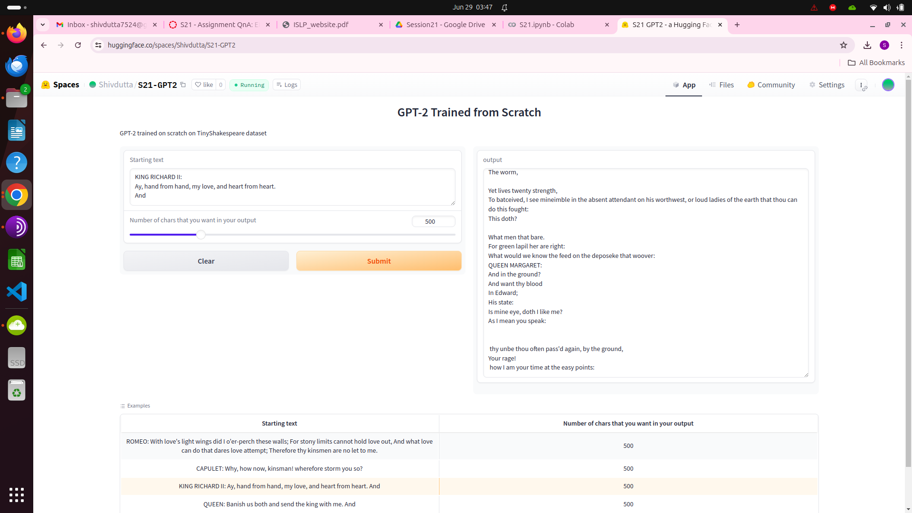

# ERA2-Session21-GPT2

## Training GPT-2 from Scratch using Tiny Shakespeare dataset

In this repo, Tiny Shakespeare dataset (input.txt) and 17 files each representing a step in training GPT-2 model from scratch. 
In files/text train_get2-1 through train_get2-8 we setup our code for training. 
From train_get2-9-speedup-1 thorugh speedup-9 we implement different techniques to speed up our training process.

S21.ipynb is the consolidation of 17 files where training is performed.
## Objective
Target - loss less than 0.099

## Training Params - 
- Steps - 6000
- Number of tokens = 1024

## Results
As seen in below image, after runnning for 6000 step with and tokens 1024, we are able to get our loss to 0.06
Training logs can be found in S21.ipynb

## App

Link to app - https://huggingface.co/spaces/Shivdutta/S21-GPT2

